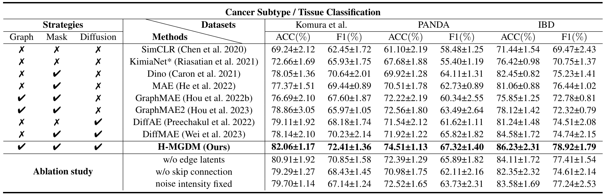

# H-MGDM
This is an official implementation of AAAI-2025 paper ["Dynamic Entity-Masked Graph Diffusion Model for Histopathology Image Representation Learning"](https://ojs.aaai.org/index.php/AAAI/article/view/33202). We introduce H-MGDM novel self-supervised Histopathology image representation learning method through the Dynamic Entity-Masked Graph Diffusion Model. Specifically, we propose to use complementary subgraphs as latent diffusion conditions and self-supervised targets respectively.

## Overview


## Code List
✅ Networks \
✅ Training \
✅ Downstream tasks

## Usage

### Environment
The codebase is tested on Python 3.9. For additional python libraries, please install by:
```
pip install requirements.txt
```

### Data preprocessing

Graph construction is following by [Histocartography](https://github.com/BiomedSciAI/histocartography) using [tissue graph generation](https://github.com/BiomedSciAI/histocartography/blob/main/examples/tissue_graph_generation.py). We show the processed graph example in [pyg format](https://pytorch-geometric.readthedocs.io/en/latest/generated/torch_geometric.data.Data.html) in `./data`.

### Training
For VAE training, we refer to the implementation of AutoencoderKL in [LDM](https://github.com/CompVis/stable-diffusion).

For H-MGDM training:
```
bash train.sh 
```

For classification downstream tasks:
```
bash tuning.sh
```

For survival tasks, we following [CLAM](https://github.com/mahmoodlab/CLAM) for WSI processing, and training scripts: 
```
cd survival
bash survival.sh
```

## Results


## Citation

```
@inproceedings{zhuang2025dynamic,
  title={Dynamic Entity-Masked Graph Diffusion Model for Histopathology Image Representation Learning},
  author={Zhuang, Zhenfeng and Cen, Min and Li, Yanfeng and Zhou, Fangyu and Yu, Lequan and Magnier, Baptiste and Wang, Liansheng},
  booktitle={Proceedings of the AAAI Conference on Artificial Intelligence},
  volume={39},
  number={10},
  pages={11058--11066},
  year={2025}
}
```
